## Vendotek VN

Руководство по установке и эксплуатации для работы в протоколе MDB

## Содержание

| Термины и сокращения                |   3 | Настройка монетоприемника для   |    |
|-------------------------------------|-----|---------------------------------|----|
| Введение                            |   4 | подключения по MEI              | 25 |
| Ограничение ответственности         |   5 | Подключение к ТА                | 26 |
| Гарантийные обязательства           |   6 | Запуск                          | 27 |
| Уход за изделием                    |   7 | Возможные ошибки при старте     | 29 |
| Описание устройства                 |   8 | Проверка работы терминала       | 30 |
| Лицевая сторона                     |   9 | Проверка основных модулей       | 32 |
| Обратная сторона                    |  10 | Меню терминала                  | 33 |
| Комплект поставки                   |  11 | Меню по Wi-Fi                   | 34 |
| Процесс оплаты                      |  12 | Меню техника                    | 36 |
| Последовательность экранов          |  13 | Настройка канала связи          | 39 |
| Подключение                         |     | Modem (sim)                     | 40 |
| Порядок подключения Vendotek VN     |  14 | Wi-Fi                           | 41 |
| Эквайринг                           |  15 | Ethernet                        | 42 |
| Личный кабинет TMS                  |  16 | Меню оператора                  | 43 |
| Фискализация                        |  17 | Советы и рекомендации           | 47 |
| Подключение и монтаж                |  18 | Подключение внешней антенны     | 48 |
| Подготовка к монтажу                |  19 | Комплектующие                   | 50 |
| Варианты монтажа в ТА               |  20 | Техническая поддержка           | 52 |
| Варианты подключения к ТА           |  22 | Приложение 1                    | 54 |
| Настройка ТА для подключения по MDB |  23 |                                 |    |

## Термины и сокращения

| POS          | Point Of Sale -точка продажи                                                                      |
|--------------|---------------------------------------------------------------------------------------------------|
| EVA          | European vending association -Европейская вендинговая ассоциация                                  |
| TMS          | Terminal Management System -личный кабинет для настройки и мониторинга                            |
| VMC          | Vending Machine Controller -контроллер торгового автомата                                         |
| ТТ           | ГК «Терминальные технологии» -разработчик и производитель Vendotek                                |
| MDB          | Multi Drop Bus -многоканальная шина                                                               |
| ТА           | Торговый автомат (VM- Vending machine)                                                            |
| Эквайринг    | Банковская услуга, позволяющая проводить безналичные платежи                                      |
| Фискализация | Процесс регистрации данных о продаже в налоговой службе, создание фискального чека согласно 54-ФЗ |

## Введение

Благодарим вас за выбор POS-терминалов Vendotek.

Терминалы Vendotek предназначены для установки на торговые автоматы и устройства самообслуживания с целью приема безналичных платежей.

Данное руководство по установке и эксплуатации содержит пошаговые инструкции по монтажу, подключению и настройке Vendotek VN для работы в протоколе MDB.

Руководства по эксплуатации Vendotek VN по протоколам Pulse, VTK и EzPOS представлены на сайте .

Обращаем внимание на инструкции по технике безопасности, отмеченные данным символом. Игнорирование рекомендаций может привести к поломке терминала и необходимости его ремонта.

кликабельная ссылка в тексте

Если вы обнаружите информацию, являющуюся неправильной, неполной или вводящей в заблуждение, напишите нам на vendsupport@termt.com . Мы обязательно рассмотрим ваши комментарии и предложения.

## Ограничение ответственности

Vendotek является брендом, принадлежащим ООО «Мультипас» ГК «Терминальные Технологии» .

Документ специально подготовлен для внутреннего использования владельцами и операторами платежных терминалов Vendotek.

Информация в любой части данного документа дополняется ООО «Мультипас» без предварительного уведомления.

Все права на материалы и информацию, представленные в документе, принадлежат (без ограничений и исключений) ООО «Мультипас».

## Гарантийные обязательства

Гарантийный срок составляет 12 месяцев с даты продажи терминала. Дата продажи указывается в тех. паспорте изделия. При невозможности установления даты продажи, гарантийный срок исчисляется от даты производства. Дата производства указана на упаковке изделия.

## Гарантийное обслуживание не распространяется на следующие случаи:

- воздействие влаги и образование конденсата с внутренней стороны терминала (на которой размещены разъемы для кабелей подключения);
- модификация терминала, самостоятельный ремонт, доработка или вскрытие без письменного согласия ООО «Мультипас». К понятию «модификация» относятся, например, такие случаи: чистка деталей терминала агрессивными средствами, нанесение на разъёмы ком. модуля масляных растворов и других составов, самостоятельная пайка и др. действия;
- устройство приобретено на вторичном рынке/передано на ознакомление либо тестирование;
- возникновение дефектов в результате некорректного использования устройства.

Поставщик не несет ответственности за ущерб, связанный с повреждением или утратой изделия при транспортировке.

## Уход за изделием

Рабочую поверхность изделия необходимо содержать в чистоте. Для очистки допускается использование мягкой ткани и моющих средств без абразивных частиц.

ВАЖНО : в процессе очистки избегайте использования растворителей, абразивных материалов и легковоспламеняющихся жидкостей.

При поставке на экране терминала наклеена защитная пленка, снимите её перед началом работы.

## ВНИМАНИЕ!

- Вскрытие и ремонт терминала производится только силами инженеров компании ООО «Мультипас».
- Попытки самостоятельного ремонта или вскрытия влекут за собой снятие терминала с гарантийного обслуживания!

## Описание устройства

Vendotek VN представляет собой терминал для безналичной оплаты товаров и услуг в вендинге и устройствах самообслуживания.

## Одно компактное устройство Vendotek VN выполняет множество функций:

- Приём оплаты бесконтактными банковскими картами (МИР, VISA, Mastercard, UnionPay), мобильными платежными системами (ApplePay, GooglePay, SamsungPay и т.д.) и устройствами с поддержкой технологии NFC;
- Приём оплаты по QR-коду через Систему Быстрых Платежей ( СБП );
- Передача данных о наличных и безналичных продажах в облачную кассу ;
- Предоставление фискального чека в виде QR-кода для сканирования покупателем через приложение ФНС;
- Фискализация маркированного товара;
- Передача данных о продажах в личный кабинет TMS;
- Показ рекламных материалов на экране;
- Передача данных в системы телеметрии : КитВендинг , Телеметрон , Эфор, TeleVend.

## Vendotek VN - лицевая сторона

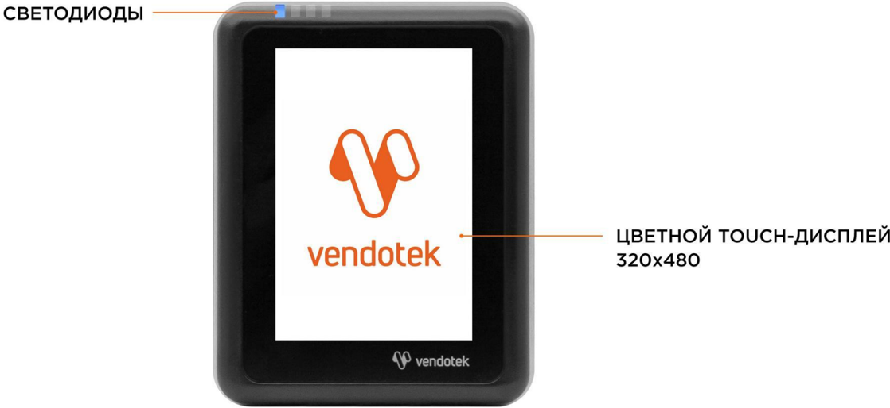

## Vendotek VN - обратная сторона

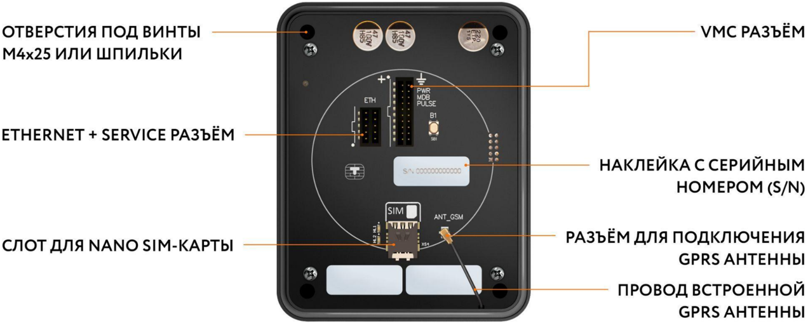

## Комплект поставки

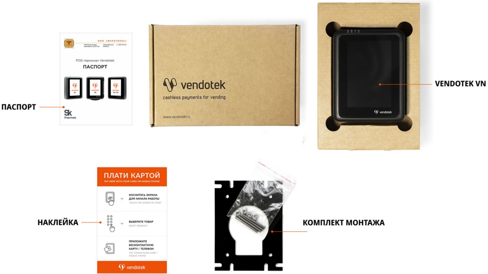

приобретайте отдельно на termt.ru

## Процесс оплаты через терминал

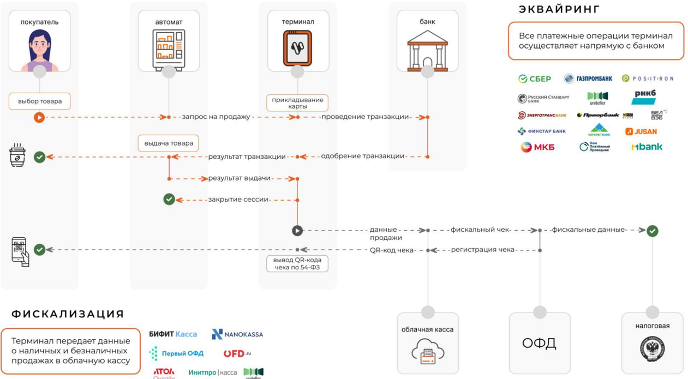

## Последовательность экранов при оплате

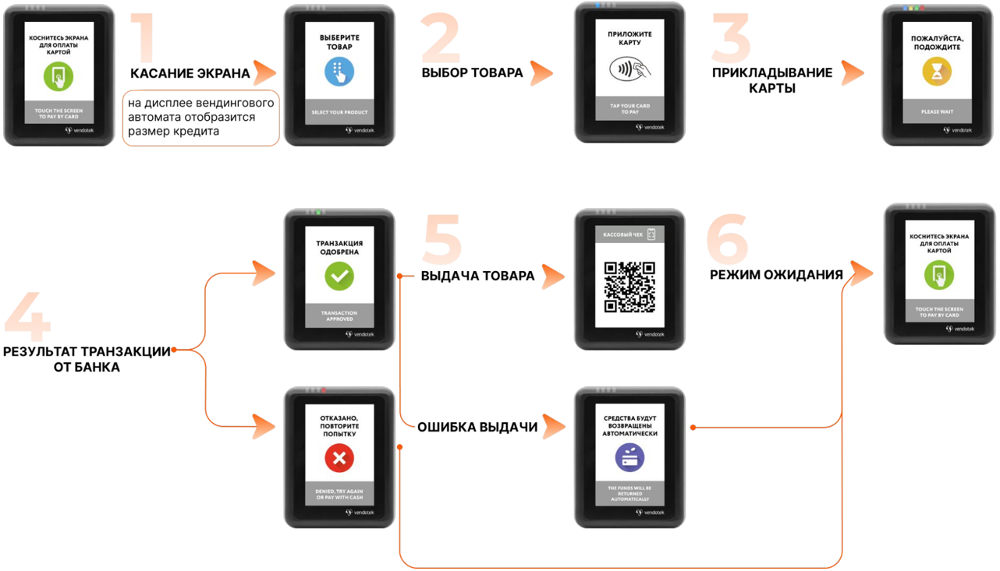

## Порядок подключения Vendotek VN

Для быстрого начала приёма платежей рекомендуем следующий порядок подключения терминала.

Шаги 1-3 могут выполняться параллельно.

Выберите подходящий банк среди партнёров Vendotek и подайте заявку на подключение эквайринга. Подключение занимает до 7 дней.

Зарегистрируйтесь в личном кабинете TMS.

Выберите подходящую онлайн-кассу среди партнёров Vendotek для фискализации платежей и выполните действия из инструкции к соответствующей кассе.

Установите и подключите терминал.

Проверьте соответствие настроек на ТА.

Проверьте работу терминала

## Подключите эквайринг

Выберите подходящий для вашего бизнеса банк-эквайер среди партнёров Vendotek:

БАНКИ ДЛЯ ПОДКЛЮЧЕНИЯ ЭКВАЙРИНГА

р/с в банке-эквайере иметь не обязательно

БАНКИ ДЛЯ ПОДКЛЮЧЕНИЯ

необходимо иметь р/с в банке-эквайере

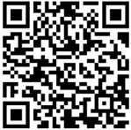

Заключите договор с банком на услуги эквайринга, использования СБП (оплаты по QR-коду).

Направьте в банк заявку на подключение терминалов. Каждому терминалу в банке присваивается уникальный идентификационный номер (TID).

После регистрации со своей стороны банк направляет в службу технической поддержки Vendotek данные для удалённой настройки терминалов.

Получите от банка уведомление об успешной регистрации терминалов. Сроки подключения зависят от банка и обычно занимают не более 7 дней.

## Личный кабинет TMS

TMS (Terminal Management System) - cистема мониторинга и управления терминалами Vendotek.

## ОСНОВНЫЕ ВОЗМОЖНОСТИ ЛИЧНОГО КАБИНЕТА TMS:

- Удалённая настройка параметров, обновление конфигураций
- Мониторинг продаж, статусов работы терминала и его взаимодействия с автоматом
- Выгрузка отчётов по транзакциям
- Загрузка планограмм для онлайн-кассы
- Снятие EVA-DTS отчётов

## РЕГИСТРАЦИЯ В ЛИЧНОМ КАБИНЕТЕ TMS

1. Отправьте запрос на vendsupport@termt.com. В запросе укажите:
2. адрес электронной почты
3. название организации
4. серийные номера терминалов.
2. Авторизуйтесь в личном кабинете , используя полученные на почту данные.
3. Проверьте, что ваши терминалы появились во вкладке «Устройства».
4. [Скачайте и ознакомьтесь с Руководством пользователя TMS .](https://termt.ru/instruktsii#lk)

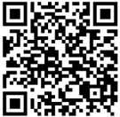

Доступ возможен с любого устройства, подключенного к интернету, включая мобильные устройства, через WEBинтерфейс. Не требует установки дополнительного ПО.

## Подключите фискализацию платежей

Vendotek VN поддерживает фискализацию наличных и безналичных платежей через облачные онлайн-кассы и ферму касс (ККМ менеджер) и отображает QR-код чека на экране в соотвествии с 54-ФЗ.

Выберите оптимальную для вас облачную кассу среди партнёров Vendotek и заключите договор.

Подключите фискализацию согласно инструкции к выбранной кассе.

- заполните информацию в ЛК облачной кассы и ЛК Vendotek
- добавьте товары, загрузите и активируйте планограммы в ЛК Vendotek
- настройте цены на автомате

[ПОДРОБНЫЕ ИНСТРУКЦИИ К ОБЛАЧНЫМ КАССАМ](https://termt.ru/fiscal)

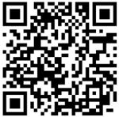

Отправьте запрос на vendsupport@termt.com для загрузки конфигурации облачной кассы в терминал.

В заявке укажите:

- серийные номера терминалов
- данные кассы и организации (см. инструкцию)

## Подключение и монтаж

Для подключения к ТА вам понадобится следующий кабель

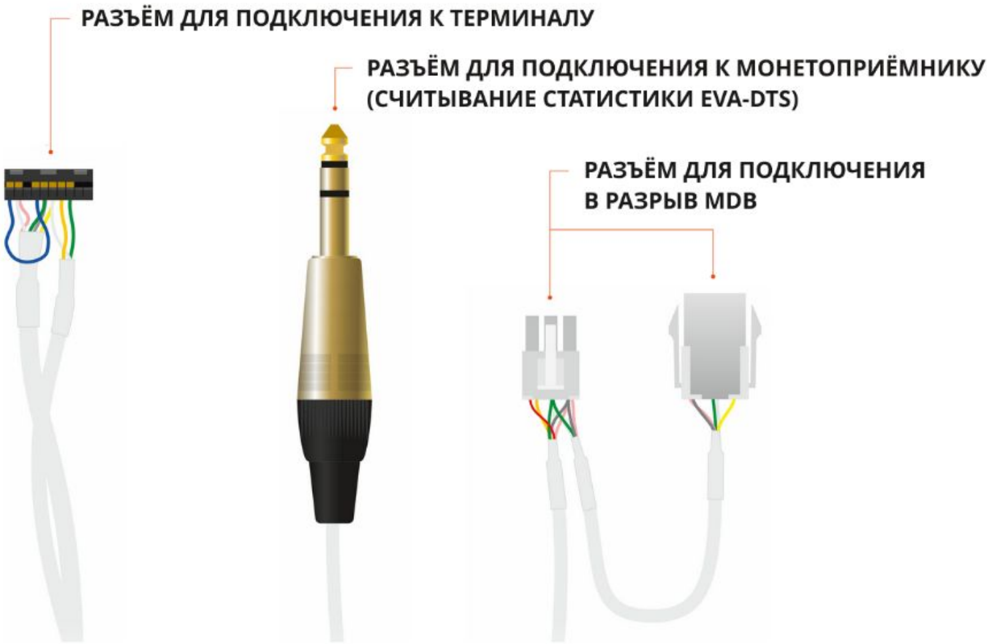

Кабель подключения, Ethernet и другие кабели вы можете приобрести дополнительно в ТТ (см. Комплектующие )

## Подготовка к монтажу

Питание к терминалу подается от ТА.

Перед подключением терминала кабелем обязательно обесточьте ТА!

- Если терминал будет получать доступ в интернет по GSM, вставьте NanoSIM-карту в слот на задней панели терминала.

sim-карта должна быть без PIN-кода .

- Если терминал будет получать доступ в Интернет по кабелю, используйте разъём ETHERNET + SERVICE для подключения соответствующего Ethernet кабеля.

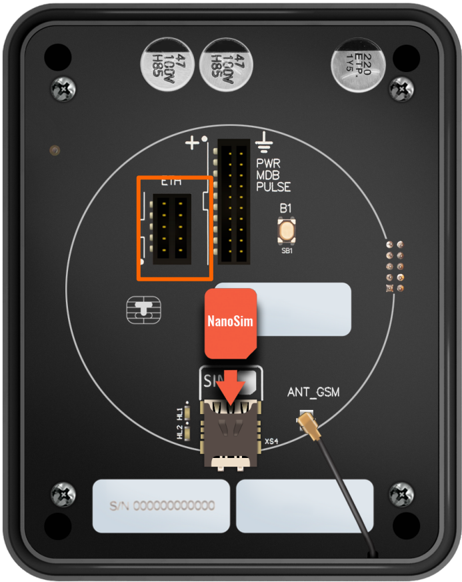

## Варианты монтажа в ТА

## ВАРИАНТ 1

## Установка в свободный EVA-слот на автомате:

1. Присоедините Vendotek VN к EVAрамке 4 шпильками M4x25 из комплекта.
2. Установите Vendotek VN в свободный EVA-слот автомата и закрепите EVAрамку гайками от автомата.

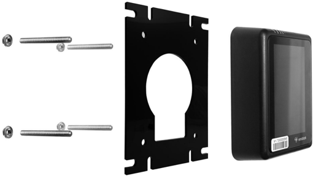

## БУДЬТЕ ВНИМАТЕЛЬНЫ И ОСТОРОЖНЫ ПРИ МОНТАЖЕ ТЕРМИНАЛА В АВТОМАТ!

При установке крепежных шпилек М4х40мм в установочные втулки терминала Vendotek степень затягивания должна составлять не более 0,4 НМ.

При толщине установочной поверхности порядка 1 мм, рекомендуемая длина винта составляет не более 25 мм и степень затягивания 0,5 НМ.

## Варианты монтажа в ТА

## ВАРИАНТ 2

## Установка при отсутствии свободного EVA-слота на автомате:

1. Используйте как шаблон EVA-рамку* из комплекта поставки терминала и просверлите отверстие 60 мм и 4 отверстия диаметром 5 мм для крепежа .
2. Вверните шпильки в Vendotek VN.
3. Установите терминал на панель автомата и закрепите четырьмя гайками М4.

*Либо распечатайте рамку посадочного места под терминал из    Приложения 1 данной инструкции. Обязательно убедитесь, что масштаб печати совпадает с приведённой на чертеже линейкой.

## БУДЬТЕ ВНИМАТЕЛЬНЫ И ОСТОРОЖНЫ ПРИ МОНТАЖЕ ТЕРМИНАЛА В АВТОМАТ!

Не прилагайте чрезмерное усилие, могут быть повреждены внутренние элементы ! При повреждении внутренних элементов стоимость ремонта может составить до 2/3 стоимости терминала!

## Варианты подключения к ТА

ТА в основном работают по двум протоколам: MDB или Executive

## АВТОМАТ ПОДКЛЮЧЕН ПО MDB

Управляющим устройством является сам автомат.

Терминал Vendotek подключается к шине MDB в разрыв, то есть между ТА и другими устройствами (монетоприёмником/ купюроприёмником или модемом телеметрии) в разъём MDB.

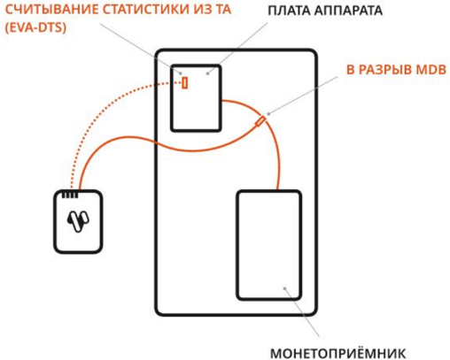

## АВТОМАТ ПОДКЛЮЧЕН ПО EXECUTIVE

Управляющим устройством является монетоприёмник.

Терминал Vendotek подключается к монетоприёмнику по MDB.

Подключение монетоприёмника к ТА осуществляется по протоколу Executive.

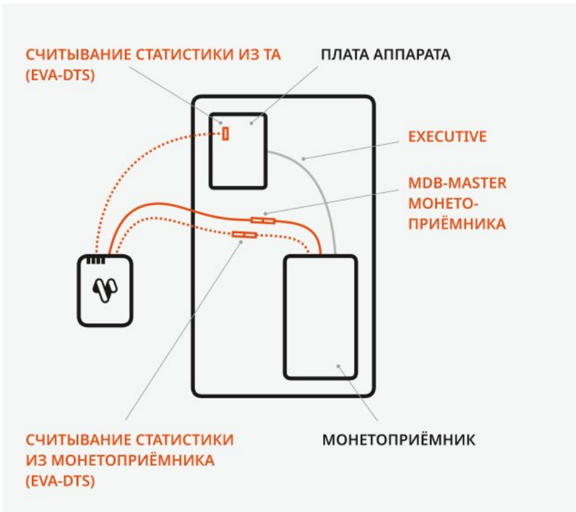

## Настройка ТА для подключения по MDB

## ДЛЯ КОРРЕКТНОЙ РАБОТЫ ТОРГОВОГО АВТОМАТА С ТЕРМИНАЛОМ:

## 1. Убедитесь, что в автомате установлены следующие настройки:

- МУЛЬТИПРОДАЖА = ВЫКЛ
- БЕЗНАЛИЧНАЯ ОПЛАТА = ВКЛ
- ПРОТОКОЛ = MDB
- МАКСИМАЛЬНЫЙ КРЕДИТ = 1000 РУБЛЕЙ для бесконтактных платежей
- МГНОВЕННАЯ СДАЧА = ВЫКЛ

При возникновении сложностей с настройкой торгового автомата, рекомендуем обратиться к поставщику данного автомата.

## Настройка ТА для подключения по MDB

## 2. Проверьте соответствие следующих настроек в автомате/монетоприёмнике и терминале:

- десятичная точка
- на терминале по умолчанию используется десятичная точка 2
- ●
- величина кредита величина кредита на автомате должна быть больше величины «виртуального» кредита установленного на терминале. По умолчанию на терминале используется кредит 500.00 руб.
- адрес cashless терминала по умолчанию терминал использует адрес cashless 1
- команда Vend Cash Sale включена на автомате/монетоприёмнике для фискализации наличных продаж

Установить необходимые настройки в терминале можно через меню техника в разделе Настройки . Также можно отправить соответствующий запрос в техническую поддержку на vendsupport@termt.com.

На некоторых моделях автоматов может понадобиться отдельно установить цены для групп безналичной оплаты в ненулевые значения и/или в значения цен групп наличной оплаты.

## Настройка монетоприемника MEI для подключения по Executive

## Для подключения по Executive Price holding на монетоприемнике MEI должны быть установлены стандартные настройки:

- Menu - Ustanovka - Optsii mashiny - Optsii Executive - Tseny ustan v = monetopriemnik
- Menu - Ustanovka - Config beznal - Cashless 1/2 - Cash Sale = Da
- Menu - Ustanovka - Optsii mashiny - Optsii Executive - Vremenya prodagi = 180 Sekund

Цены для групп безналичной оплаты в ненулевые значения и/или в значения цен групп наличной оплаты настраиваются в монетоприёмнике.

Также для некоторых моделей автоматов может потребоваться произвести дополнительные настройки на монетоприёмнике и/или автомате.

## Подключение к ТА

Подключение терминала необходимо осуществлять только при выключенном автомате, подключать терминал на «горячую» нельзя!

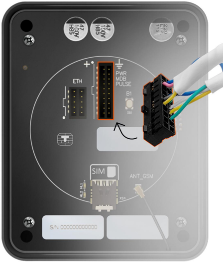

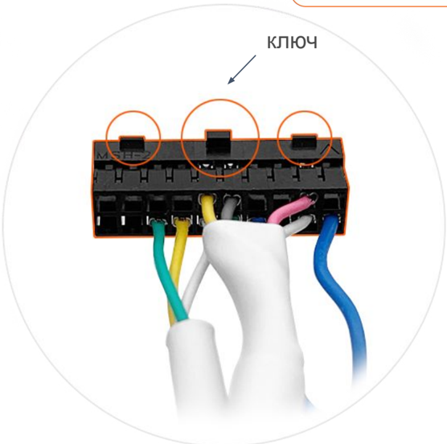

Подключите терминал кабелем к автомату в соответствии с используемым типом подключения (MDB/Executive).

Кабель подключения устанавливается в разъем VMC .

Положение ключа определяется по маркировке на плате.

## Запуск

Включите автомат. Терминал запустится автоматически:

через 3-5 секунд после подачи питания на терминале отобразится экран с информацией об этапах запуска.

## Примечание:

в некоторых автоматах необходимо закрыть дверцу или нажать сервисную кнопку, чтобы позволить терминалу установить соединение с ТА.

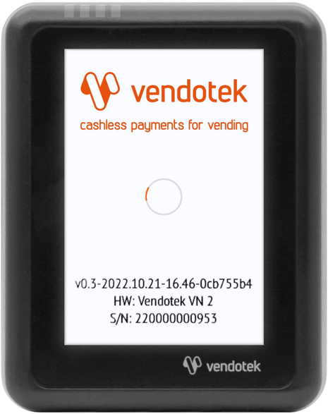

После успешного запуска терминала на экране отобразятся шестерёнка и надпись « КАРТЫ ВРЕМЕННО НЕ ПРИНИМАЮТСЯ ».

Через 3-4 секунды автоматически произойдет обмен настройками между терминалом и ТА по MDB, и на экране отобразится сообщение « КОСНИТЕСЬ ЭКРАНА ДЛЯ ОПЛАТЫ КАРТОЙ » или « ВЫБЕРИТЕ ТОВАР ».

Vendotek VN готов к приему платежей.

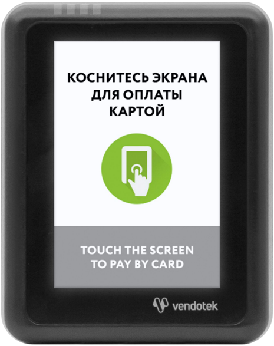

## Возможные ошибки при старте

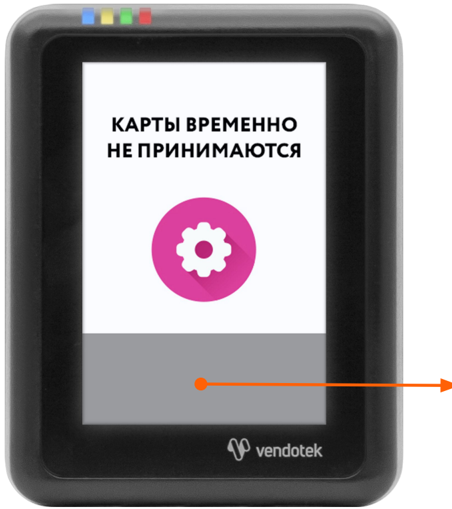

на терминале отсутствует конфигурация для корректной работы

неполадки в работе с банковским хостом

безналичная оплата временно не принимается, можно оплатить наличными

отсутствует доступ в интернет по выбранному каналу связи

произошел разрыв соединения между ТА и терминалом

при выбранном канале связи «модем» нет связи по sim-карте

Если при заказе терминала не была указана необходимая конфигурация ПО, то необходимо оформить соответствующий запрос на vendsupport@termt.com.

## Проверка работы терминала

После установки и запуска терминала вы можете проверить его работоспособность с помощью тестов через меню оператора (см. раздел «Меню терминала»).

NFC: тестовое чтение карты

Тест связи: проверка интернет-соединения:

- окно с сообщением « Успех » - соединение в порядке, терминал имеет доступ в интернет.
- ❌ окно с сообщением « Тест связи не успешен » -ошибка:

## Рекомендации:

- повторите данный тест с интервалом в несколько минут
- проверьте, вставлена ли sim-карта с доступом в интернет
- проверьте, подключен ли Ethernet-кабель (в случае, если терминал настроен на работу по Ethernet)
- подключен ли терминал к соответствующей точке доступа (в случае, если терминал настроен на работу по Wi-Fi)

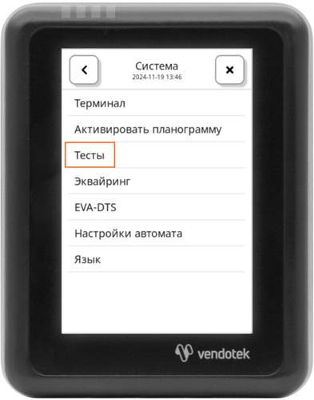

## Проверка работы терминала

Для двух следующих тестов убедитесь, что терминал инициализирован по MDB на терминале будет отображаться экран « КОСНИТЕСЬ ЭКРАНА ДЛЯ ОПЛАТЫ КАРТОЙ ».

## Выдача товара:

На экране высветится предупреждение: «Следующая выдача товара будет бесплатной» (карту прикладывать не нужно) → появится экран « КОСНИТЕСЬ ЭКРАНА ДЛЯ ОПЛАТЫ КАРТОЙ ».

Тестовая продажа: проверка полного цикла продажи

На экране высветится предупреждение: « Следующая выдача товара будет бесплатной, потребуется прикладывание карты » → Автоматически начнется сессия продажи - следуйте обычному алгоритму оплаты картой. При проведении этого теста транзакция будет одобрена автоматически.

## Раздел Эквайринг

Тест хоста: проверка соединения с банковским хостом. Данный пункт меню можно выполнять только после подключения терминала к банку .

## Проверка работы основных модулей

Для проверки статуса отдельных модулей и оценки работоспособности терминала в целом, перейдите в меню оператора раздел Терминал -&gt; О терминале и нажмите кнопку Дополнительно .

В данном разделе меню представлена информация о статусе основных модулей терминала:

- Онлайн - наличие доступа в интернет;
- Эквайринг - связь с банком;
- Эквайер - показывает на работу с каким банком настроен терминал
- Последняя сверка - дата и время проведения последней сверки с банком;
- Последняя транзакция - дата и время проведения последней транзакции;
- VM - статус подключения к ТА.
- - модуль активен.
- ✖ - модуль неактивен/есть проблемы.

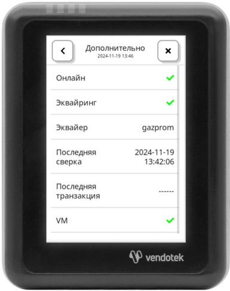

Список модулей может отличаться от приведенного в зависимости от конфигурации терминала.

## Меню терминала

## ПОЛЬЗОВАТЕЛЬСКИЙ ИНТЕРФЕЙС ТЕРМИНАЛА ВКЛЮЧАЕТ ДВА МЕНЮ

## Меню техника

- Настройка канала связи, проверка уровня сигнала
- Обновление ПО и конфигурации
- Сброс настроек
- Выгрузка логов

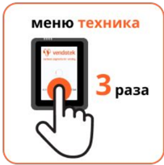

## Меню оператора

- Настройки параметров для корректного взаимодействия с ТА
- Активация планограммы
- Тесты для проверки работы терминала
- Работа с EVA DTS

терминал полностью загрузился, коснуться экрана одновременно двумя пальцами, удерживать 6 секунд

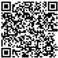

при старте терминала 3 раза коснуться экрана (также возможен доступ по Wi-Fi c мобильного телефона)

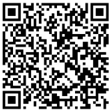

Для входа в некоторые разделы меню потребуется ввод пароля . Для получения пароля отправьте соответствующий запрос на vendsupport@termt.com. По запросу пароли могут меняться .

## Меню по Wi-Fi

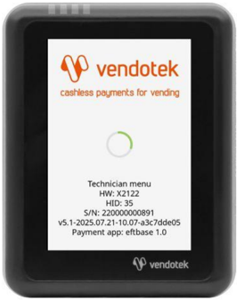

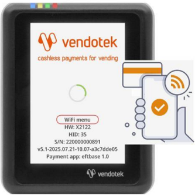

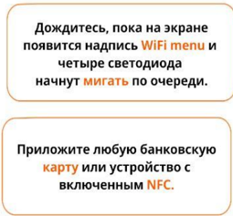

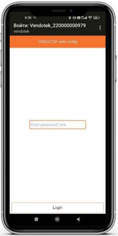

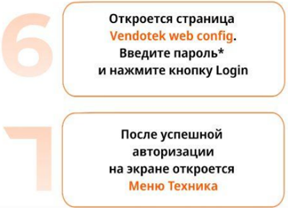

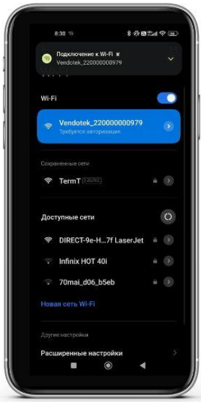

## Меню по Wi-Fi

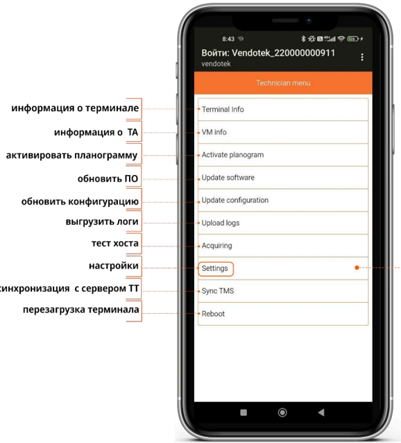

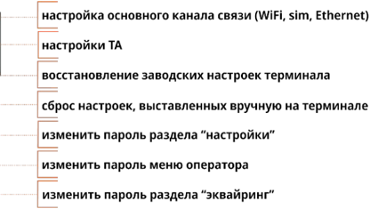

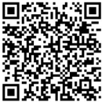

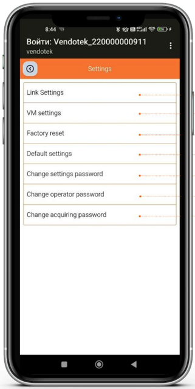

## Меню техника

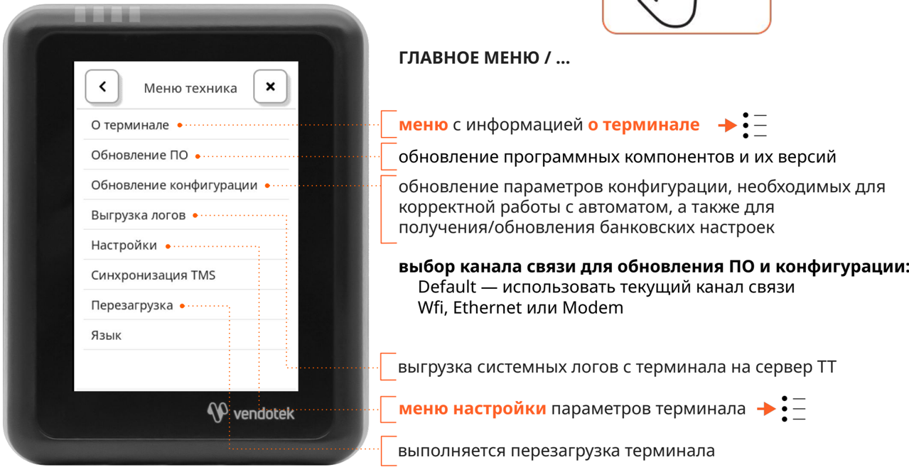

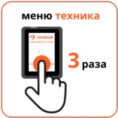

## Меню техника

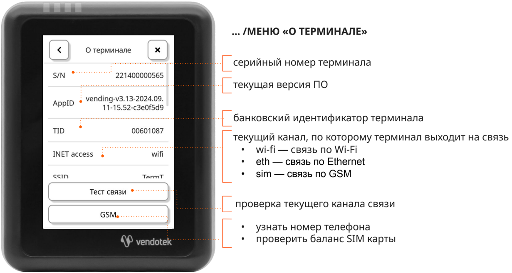

## Меню техника

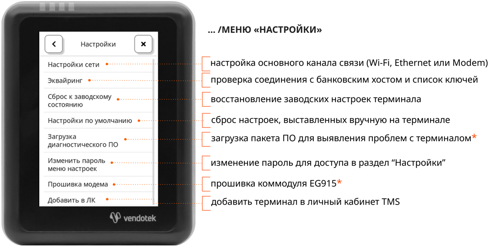

*выполнять только по согласованию со службой техподдержки Vendotek

## Настройка канала связи

Vendotek VN может получать доступ в интернет по GSM, Wi-Fi или Ethernet.

По умолчанию Vendotek VN настроен на доступ в Интернет по GSM.

## ДЛЯ НАСТРОЙКИ КАНАЛА СВЯЗИ:

1. Войдите в меню техника .
2. Перейдите в Настройки и введите пароль от меню техника (пароль необходимо запросить в службе технической поддержки vendsupport@termt.com)
3. Перейдите в Настройки сети .
4. В выпадающем списке выберите необходимый канал связи
5. Нажмите на кнопку «Тест связи». Терминал выполнит проверку интернет-соединения:
- появление сообщения «Успех» и кнопки «Продолжить» соединение в порядке;
- появление сообщения «Ошибка настроек сети» и кнопки «Продолжить» - соединение неуспешно.
6. Нажмите кнопку «Сохранить». Появится сообщение «Настройки сохранены» и кнопка «Продолжить».

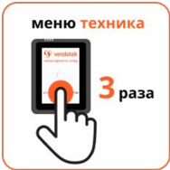

Видеоинструкции по настройке

канала связи

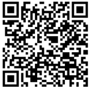

## [Wi-Fi](https://drive.google.com/file/d/1Yc4aPISh1D-lgcrMclyMSH91kjkRaxuJ/view?usp=drive_link)

- [Modem](https://drive.google.com/file/d/1-QUrPEacqBrd4F7Nsx2ZYIhMt4Y4w5rb/view?usp=drive_link)
- [Ethernet](https://drive.google.com/file/d/1sBF0cKgBDGPqPkv2Lqax7VnjR6Vzr2tZ/view?usp=drive_link)

## Настройка канала связи. Modem (sim)

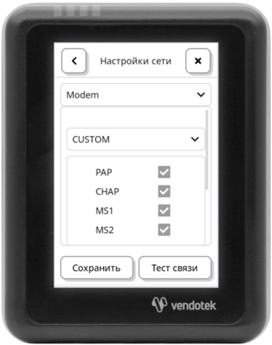

выбрать «CUSTOM» и самостоятельно указать протокол аутентификации, а также ввести следующие параметры (необходимо уточнить

у оператора используемой sim-карты):

- username - имя пользователя;
- password - пароль;
- apn - идентификатор сети пакетной передачи данных.

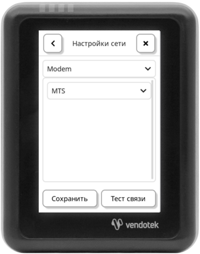

в выпадающем списке выбрать один из стандартных профилей (например, MTS, BeeLine и тд)

## Настройка канала связи. Wi-Fi

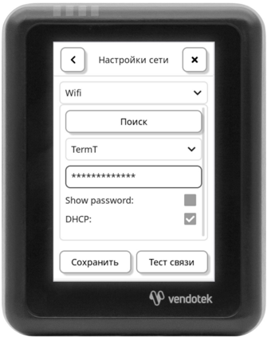

Wifi: терминал выполнит поиск доступных для подключения сетей и предложит варианты в выпадающем списке. После выбора точки доступа введите пароль в поле « password »

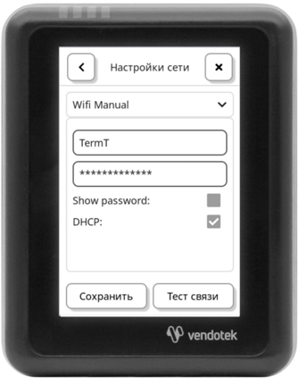

Wifi Manual: вручную ввести параметры точки доступа:

- ssid - идентификатор беспроводной сети (название точки доступа);
- password - пароль.

В случае необходимости использования статической адресации, снимите галочку DHCP и заполните: IP, Mask, Gateway, DNS main, DNS Backup.

## Настройка канала связи. Ethernet

динамический IP-адрес -установить галочку напротив

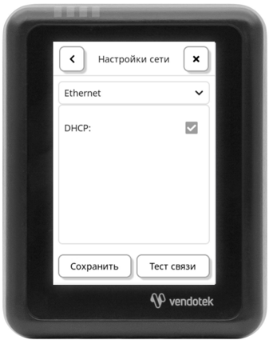

пункта DHCP

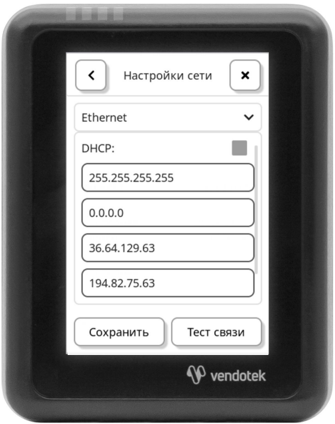

статический IP-адрес - убрать галочку напротив пункта DHCP и вручную ввести соответствующие параметры:

- ip - ip-адрес;
- mask - маска для определения по IP-адресу адреса подсети и адреса узла;
- gateway - шлюз;
- dns main - IP-адрес основного DNS-сервера;
- dns backup - IP-адрес резервного DNSсервера

## Меню оператора

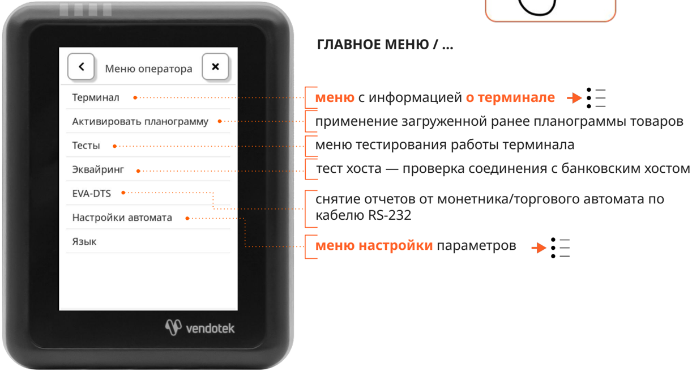

## Меню оператора

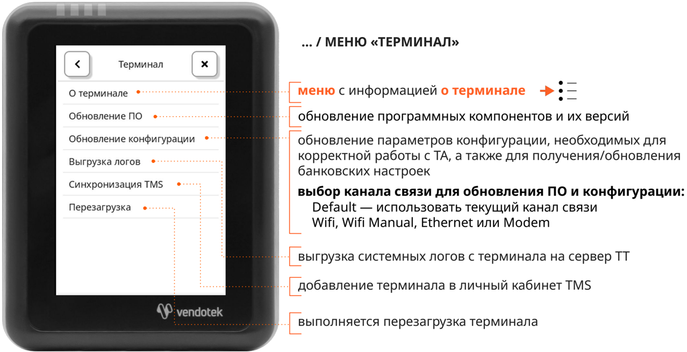

## Меню оператора

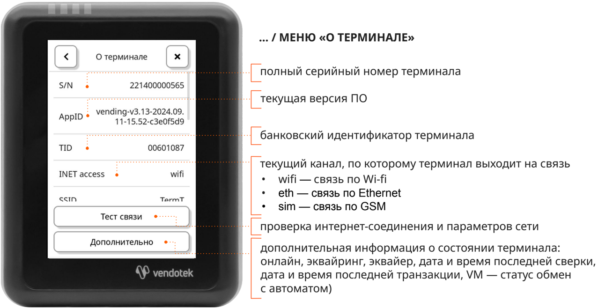

## Меню оператора

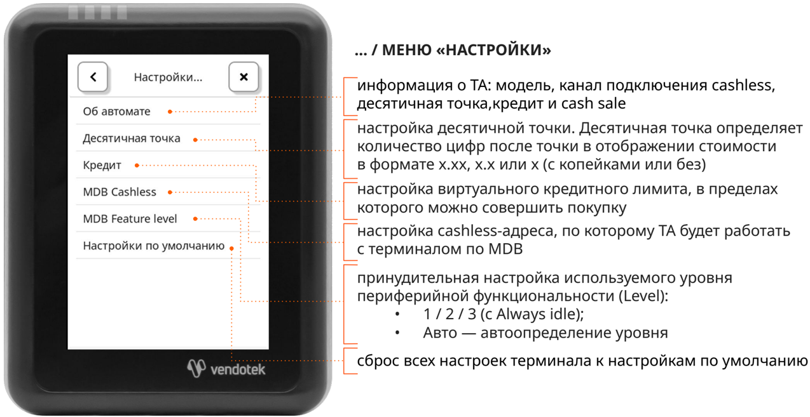

## Советы и рекомендации

СОВЕТЫ

РЕКОМЕНДАЦИ

- Если терминал дольше минуты не загружается дальше стартового экрана с информацией об этапах запуска и при этом в нижней части экрана отображается сообщение «Установка соединения», значит на терминале слабый уровень сигнала/отсутствует доступ в интернет.
- После полной загрузки терминала подождите 30-45 секунд перед запуском тестовой транзакции: иногда требуется некоторое время для регистрации в новой мобильной сети (если терминал настроен на работу по sim-карте).
- Тестовая транзакция может занимать до 60 секунд в зависимости от качества соединения/сигнала мобильной сети.
- Вы можете определить качество связи по времени проведения тестовой транзакции: меньше 15 секунд - хорошее; 15-40 секунд - среднее; более 40 секунд - плохое/подключение отсутствует.
- Вы можете проводить тестовые транзакции столько раз, сколько необходимо это не влияет на сумму продаж и не модифицирует денежные счётчики автомата.

## Подключение внешней антенны

При слабом уровне GSM сигнала, воспользуйтесь внешней антенной.

Приобрести внешнюю антенну и переходник вы можете в ТТ или специализированном магазине.

Параметры антенны: Диапазон работы 4G, разъём SMA.

Параметры переходника: U.FL (разъем на терминале) - SMA-female (разъём антенны)

1. Отключите питание автомата.
2. АККУРАТНО отсоедините встроенную антенну, потянув РАЗЪЁМ на себя. Не тяните ЗА ПРОВОД.

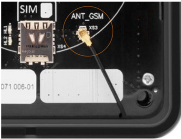

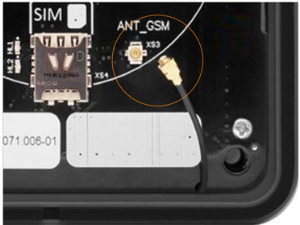

## Подключение внешней антенны

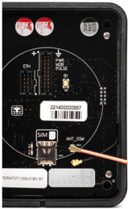

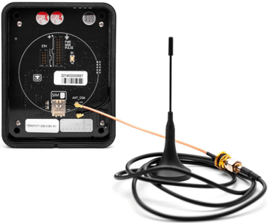

3. АККУРАТНО подсоедините разъём переходника внешней антенны до щелчка.

НЕ ПРИЛАГАЙТЕ чрезмерных усилий - это может привести к повреждению разъёма терминала.

4. Подсоедините внешнюю антенну, зафиксировав её кабель на переходнике при помощи гайки. Следите, чтобы провод переходника НЕ ПЕРЕКРУЧИВАЛСЯ.
5. Включите автомат.
6. Проверьте параметры сети в меню оператора или меню техника в разделе «О терминале».
7. При слабом уровне сигнала попробуйте выбрать другого оператора связи (Билайн/МТС/…).

## Сопутствующие комплектующие

| Артикул           | Наименование                                       | Фото   |
|-------------------|----------------------------------------------------|--------|
| TERMT051.034.008  | Кабель Ethernet                                    |        |
| TERMT051.034.0026 | Переходник к блоку питания                         |        |
| ТERMT007.033.0010 | Кабель MDB + считывание Аудита из автомата (Necta) |        |
| ТERMT005.0230.001 | Переходник для снятия ошибок с FAS к RS-232        |        |

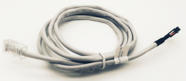

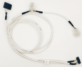

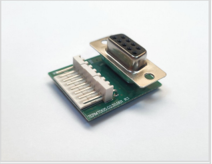

## Сопутствующие комплектующие

| Артикул           | Наименование                                               | Фото   |
|-------------------|------------------------------------------------------------|--------|
| TERMT007.033.0009 | Кабель MDB + считывание EVA DTS с монетоприёмника          |        |
| -                 | Комплект для усиления GSM сигнала POS-терминала Vendotek   |        |
| -                 | Переходник от POS-терминала Vendotek к внешней GSM антенне |        |

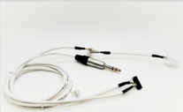

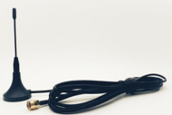

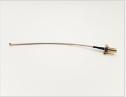

## Техническая поддержка

## Заявки в службу технической поддержки Vendotek принимаются в электронном виде.

## В заявке укажите:

- 12-ти значный серийный номер терминала;
- опишите проблему и по возможности приложите фото/видео;
- выгрузите логи с терминала через меню техника или меню оператора.

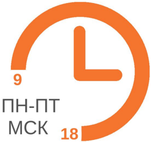

## Спасибо за выбор нашего терминала!

[vendsupport@termt.com](mailto:vendsupport@vendotek.com)

## Приложение 1. Чертеж посадочного места

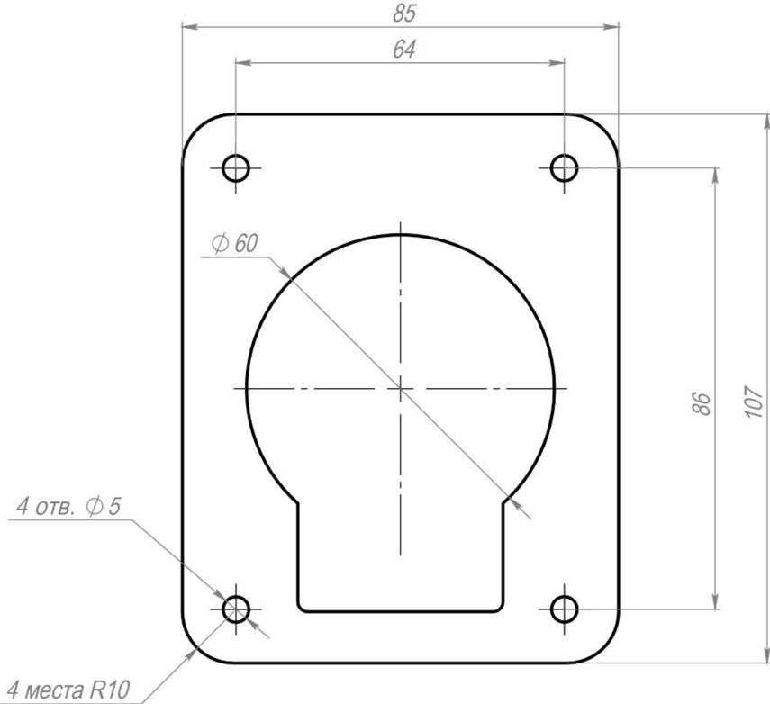

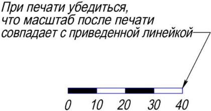

При печати установите параметр масштаба - фактический размер 100%